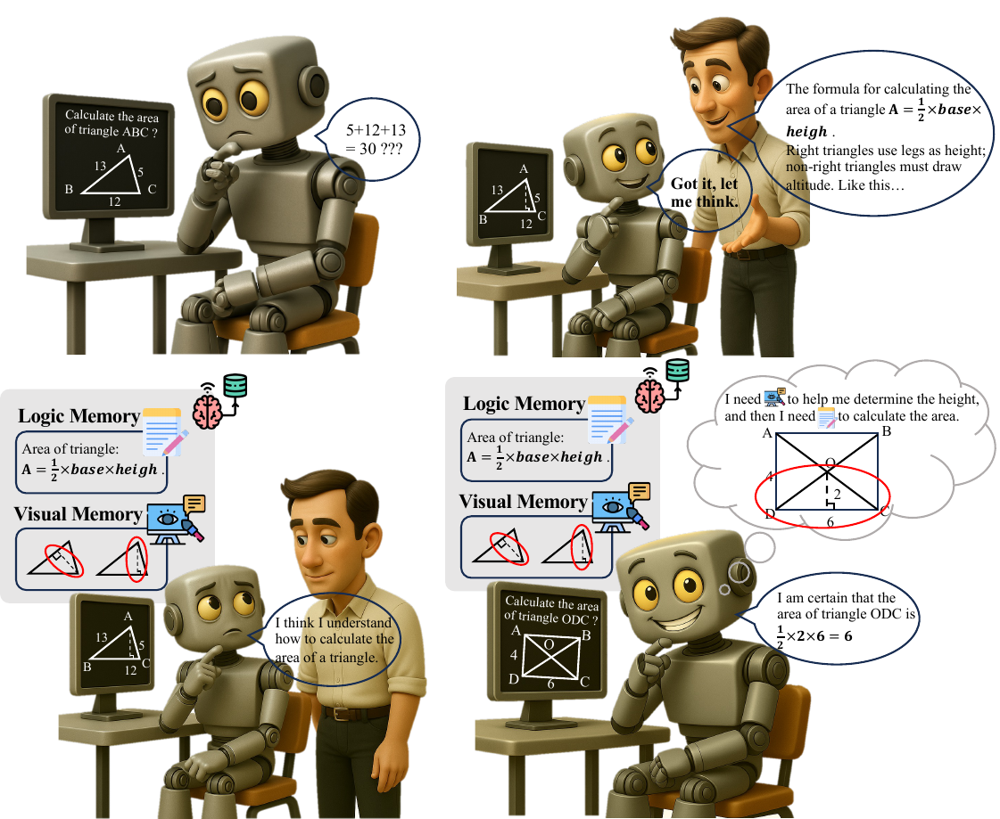
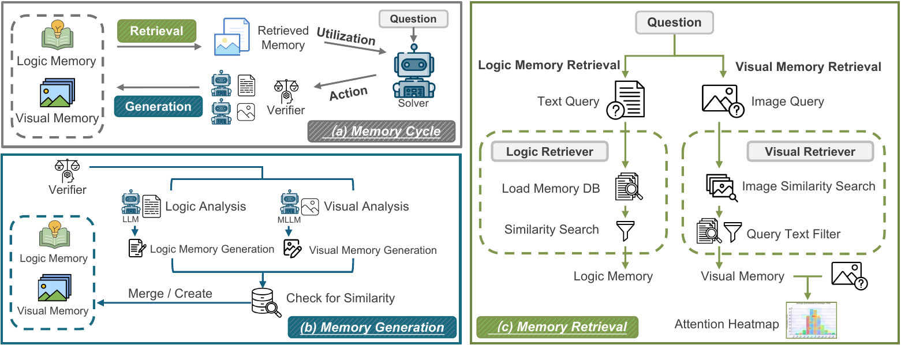

<div align="left">

## **ViLoMem**: Agentic Learner with Grow-and-Refine Multimodal Semantic Memory

Weihao Bo<sup>1,2</sup>, Shan Zhang<sup>3</sup>, Yanpeng Sun<sup>4</sup>, Jingjing Wu<sup>2</sup>, Qunyi Xie<sup>2</sup>, Xiao Tan<sup>2</sup>, Kunbin Chen<sup>2</sup>, Wei He<sup>2</sup>, Xiaofan Li<sup>2</sup>, Na Zhao<sup>4</sup>, Jingdong Wang<sup>2‡</sup>, Zechao Li<sup>1†</sup>

<sub><sup>1</sup>Nanjing University of Science and Technology &nbsp; <sup>2</sup>Baidu Inc &nbsp; <sup>3</sup>Adelaide AIML &nbsp; <sup>4</sup>Singapore University of Technology and Design</sub>

<sub><sup>‡</sup>Project Leader &nbsp;&nbsp; <sup>†</sup>Corresponding author</sub>

<a href="https://weihao-bo.github.io/ViLoMeo-page/"></a>
<a href="https://arxiv.org/abs/2511.21678"></a>
<a href="https://arxiv.org/pdf/2511.21678"></a>
<a href="#citation"></a>

</div>

<div align="center">
  
  <p>
    <em><strong>Multimodal Semantic Memory Enables Progressive Learning.</strong> When solving multimodal problems, early attempts may contain both logical and visual errors. Through feedback, the model refines its logical memory for theorem application and its visual memory to avoid perceptual traps—improving by integrating <em>where to look</em> with <em>how to reason</em>.</em>
  </p>
</div>

## Method

**ViLoMem** is a plug-in dual-stream memory framework for multimodal reasoning, featuring a closed-loop *Memory Cycle* that enables continuous learning from reasoning and perception errors.

<div align="center">
  
</div>

### Key Components

- **(a) Memory Cycle:** A closed-loop learning mechanism where both logical and visual memories are retrieved and utilized by the solver. The verifier evaluates actions to filter redundant trajectories and update both memory streams.
- **(b) Memory Generation:** An error-attribution framework using LLM for logical analysis and MLLM for visual analysis, producing structured memory schemas through similarity-based merge and create operations.
- **(c) Memory Retrieval:** Specialized dual-stream retrieval—visual memories undergo image-embedding retrieval followed by question-specific filtering; logical memories are retrieved through problem analysis and text-embedding similarity.

## Features

- **Dual Memory System**: Learns from both logical reasoning errors and visual understanding errors
- **Baseline Agent**: Simple VLM inference without memory for comparison
- **Memory-Enabled Agent**: Full memory retrieval and generation workflow
- **VLMEvalKit Integration**: Automatic benchmark download and conversion
- **Flexible Model Support**: Works with OpenAI, Qwen, and other vision-language models

## Quick Start

### 1. Environment Setup

```bash
# Clone the repository
git clone https://github.com/weihao-bo/ViLoMem.git
cd ViLoMem

# Create virtual environment (Python 3.11+ required)
uv venv --python 3.11
source .venv/bin/activate

# Install dependencies
uv pip install -e .
```

### 2. Configuration

Copy the example environment file and configure your API keys:

```bash
cp .env.example .env
```

Edit `.env` and set the following variables:

```bash
# Required: Dataset root directory
DATASET_ROOT_DIR=/path/to/your/datasets

# Required: OpenAI-compatible API endpoint
OPENAI_API_KEY=your_api_key_here
OPENAI_API_BASE=https://api.openai.com/v1

# Optional: LangSmith tracing
LANGCHAIN_TRACING_V2=false
LANGCHAIN_API_KEY=your_langsmith_key_here
```

### 3. Running Evaluations

#### Baseline Agent (No Memory)

```bash
uv run python run_agent_eval.py --config config/baseline/MathVista_MINI.yaml
```

#### Memory-Enabled Agent

```bash
uv run python run_agent_eval.py --config config/ViLoMem/MathVista_MINI.yaml
```

### 4. Resume Previous Run

```bash
uv run python run_agent_eval.py --config config/baseline/MathVista_MINI.yaml --resume output/baseline_gpt-4.1/MathVista_MINI
```

## Configuration Files

### Baseline Configuration (`config/baseline/MathVista_MINI.yaml`)

```yaml
# Dataset Configuration
dataset:
  root_dir: "${DATASET_ROOT_DIR}"  # Set via environment variable
  benchmark: "MathVista_MINI"
  start_index: 1
  limit: 0  # 0 means process all examples

# Model Configuration
model:
  name: "openai:gpt-4.1"  # GPT-4.1 via OpenAI-compatible endpoint
  temperature: 0.7
  max_tokens: 10240

# Output Configuration
output:
  dir_prefix: "output/baseline_gpt-4.1"
  enable_tracing: false

# Verification Configuration
verification:
  enable: true

# Concurrent Execution
concurrent_execution:
  max_workers: 20
```

### ViLoMem Configuration (`config/ViLoMem/MathVista_MINI.yaml`)

The memory-enabled configuration includes additional sections for:

- **Logic Memory**: Stores and retrieves guidelines for logical reasoning errors
- **Visual Memory**: Stores and retrieves guidelines for visual understanding errors
- **Heatmap Generation**: Generates attention heatmaps for visual analysis
- **Memory Reuse**: Supports memory reuse across evaluation runs

See `config/ViLoMem/MathVista_MINI.yaml` for full configuration options.

## Project Structure

```
ViLoMem/
├── run_agent_eval.py           # Main evaluation script
├── config/
│   ├── baseline/               # Baseline agent configurations
│   │   └── MathVista_MINI.yaml
│   └── ViLoMem/                # ViLoMem agent configurations
│       └── MathVista_MINI.yaml
├── src/
│   ├── common/                 # Shared utilities
│   ├── vl_agent/               # Memory-enabled agent implementation
│   └── vl_agent_baseline/      # Baseline agent implementation
├── tools/                      # Dataset utilities
├── pyproject.toml              # Project dependencies
├── .env.example                # Environment variable template
└── README.md                   # This file
```

## Output Format

Results are saved to `output/{agent_type}/{benchmark}/results.json`:

```json
{
  "summary": {
    "dataset_path": "/path/to/dataset",
    "model": "openai:gpt-4.1",
    "total_examples": 100,
    "verified_count": 85,
    "accuracy": 0.85,
    "evaluation_mode": "baseline"
  },
  "results": [
    {
      "example_id": "example_1",
      "question": "What is the range of the numbers?",
      "prediction": "Step 1: ...\nFinal Answer: \\boxed{7}",
      "gold_answer": "7",
      "verified": true
    }
  ]
}
```

## Supported Benchmarks

This project supports all benchmarks available in [VLMEvalKit](https://github.com/open-compass/VLMEvalKit), including but not limited to:

- **Math & Reasoning**: MathVista, MathVision, GeoQA, etc.
- **General VQA**: MME, MMBench, SEED-Bench, etc.
- **Science**: ScienceQA, AI2D, etc.
- **Chart & Document**: ChartQA, DocVQA, InfoVQA, etc.
- **Real-world**: RealWorldQA, etc.

For the complete list of supported benchmarks, please refer to the [VLMEvalKit documentation](https://github.com/open-compass/VLMEvalKit).

## Model Providers

Supported model formats:

- `openai:model-name` - OpenAI-compatible API (e.g., `openai:gpt-4.1`, `openai:gpt-4o`)
- `qwen:model-name` - DashScope API (e.g., `qwen:qwen3-vl-8b-instruct`)
- `local:model-name` - Local vLLM deployment

## Attention Map Generation

The attention map generation is based on the Qwen2.5-VL attention mechanism, inspired by [mllms_know](https://github.com/saccharomycetes/mllms_know.git).

To enable attention heatmap generation:

1. Set `heatmap_generation.enable: true` in your config file
2. Configure the Qwen2.5-VL model settings:

```yaml
heatmap_generation:
  enable: true
  debug: true  # Save heatmap images for debugging
  include_question_in_heatmap: true
  qwen25vl:
    model: Qwen/Qwen2.5-VL-3B-Instruct  # Or other Qwen2.5-VL variants
    general_prompt: Describe this image.
    attention_layer: 22
    devices:
      - cuda:0
    per_device_max_parallel: 5
```

**Note**: This feature requires local deployment of a Qwen2.5-VL model with GPU support.

## Citation

If you find this work useful, please cite our paper:

```bibtex
@misc{bo2025agenticlearnergrowandrefinemultimodal,
      title={Agentic Learner with Grow-and-Refine Multimodal Semantic Memory},
      author={Weihao Bo and Shan Zhang and Yanpeng Sun and Jingjing Wu and Qunyi Xie and Xiao Tan and Kunbin Chen and Wei He and Xiaofan Li and Na Zhao and Jingdong Wang and Zechao Li},
      year={2025},
      eprint={2511.21678},
      archivePrefix={arXiv},
      primaryClass={cs.AI},
      url={https://arxiv.org/abs/2511.21678},
}
```

## License

MIT License